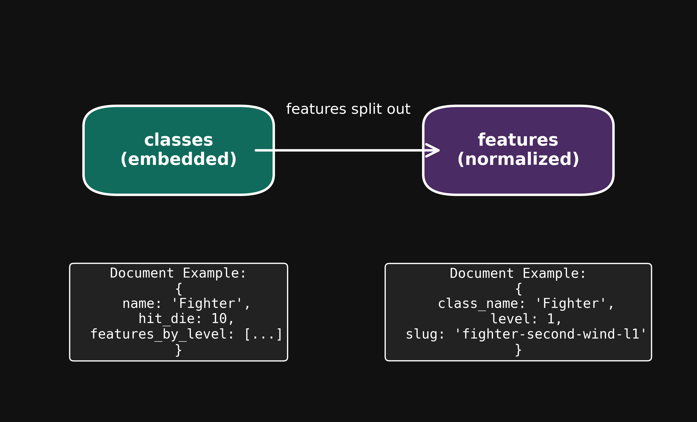
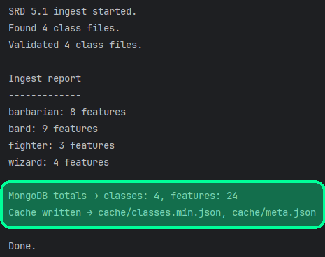

<p align="center">
  
</p>

<h1 align="center">D&D 5e SRD — MongoDB</h1>

<p align="center">
  <em>A small SRD data project that demonstrates JSON Schema validation, MongoDB document patterns, and a lightweight read-only API.</em>
</p>

[](https://github.com/dmtr-karan/dnd-srd-mongo/actions/workflows/ci.yml)
[](https://github.com/dmtr-karan/dnd-srd-mongo/actions/workflows/validate.yml)
[](LICENSE)
[](https://dnd.wizards.com/resources/systems-reference-document)
[](https://www.python.org/downloads/)
[](https://www.mongodb.com/)

<sub>Keywords: D&D, 5e, SRD, MongoDB, TTRPG</sub>

## ✨ What this is

A small, focused project that ingests **selected D&D 5e SRD class data**, validates it with **JSON Schema**, and stores it in **MongoDB** in two forms:

* **Embedded `classes`** collection with full `features_by_level`
* **Normalized `features`** collection with stable slugs + indexes

It also emits **deterministic cache JSONs** for simple reads and ships a tiny **read helper layer** plus tests.

The scope is intentionally limited: validate SRD-safe class data, load it into MongoDB, and expose deterministic read paths.

---

## 📦 Features

* Canonical SRD class JSONs (`data/srd/classes/`)
* JSON Schema validation (`schemas/srd-class-5e-2014.json`)
* Ingest script (`scripts/ingest_srd.py`) with idempotent upserts
* Canonical indexes (`scripts/indexes.mongo.js`)
* Strict validator (`scripts/feature_validator.mongo.js`)
* Cache emitter (`cache/classes.min.json`, `cache/meta.json`)
* Read-only FastAPI grounding endpoints under `app/`
* Smoke, helper, API-grounding, cache, schema, and optional Atlas tests under `tests/`

---

## 📁 Repo Structure

```
dnd-srd-mongo/
├─ .github/
│  └─ workflows/
│     ├─ ci.yml                         # Manual/legacy CI (reference)
│     ├─ issues.yml                     # Logs new issues to run summary
│     └─ validate.yml                   # Main validation + artifacts pipeline
├─ app/
│  ├─ __init__.py                       # FastAPI app factory (creates app + includes router)
│  ├─ main.py                           # FastAPI entrypoint (`app = create_app()`) for ASGI servers
│  └─ routes.py                         # Read-only SRD endpoints: meta/classes + Mongo-backed feature routes (optional)
├─ assets/
│  ├─ crest.png                         # README header (square)
│  ├─ crest_social.png                  # 1280×640 social preview
│  ├─ crest_widescreen.png              # 16:9 variant
│  ├─ ingest.png                        # Validation/ingest screenshot (square)
│  ├─ ingest_wide.png                   # 16:9 variant
│  ├─ schema.png                        # Schema diagram (square)
│  └─ schema_wide.png                   # 16:9 variant
├─ cache/                               # Deterministic cache JSONs for demos
│  ├─ classes.min.json
│  └─ meta.json
├─ data/
│  └─ srd/
│     ├─ classes/                       # Canonical SRD class JSONs
│     │  ├─ barbarian.json
│     │  ├─ bard.json
│     │  ├─ fighter.json
│     │  └─ wizard.json
│     └─ raw/                           # Source SRD (pre-normalization)
│        ├─ barbarian.json
│        ├─ bard.json
│        ├─ fighter.json
│        └─ wizard.json
├─ schemas/
│  ├─ srd-class-5e-2014.json            # Class JSON Schema validation
│  └─ srd-spell-5e-2014.json            # Spell JSON Schema validation
├─ scripts/
│  ├─ db.py                             # Canonical MongoDB connection helpers
│  ├─ feature_validator.mongo.js        # Strict collection validator
│  ├─ indexes.mongo.js                  # Canonical indexes
│  ├─ ingest_srd.py                     # Idempotent ETL/ingest
│  ├─ read_helpers.py                   # Tiny read layer (example queries)
│  └─ __init__.py
├─ tests/
│  ├─ test_api_grounding.py             # Read-only API / grounding endpoint checks
│  ├─ test_atlas_smoke.py               # Optional Atlas connectivity smoke test
│  ├─ test_cache_guardrails.py          # Cache/data consistency checks
│  ├─ test_read_helpers.py              # Tiny Mongo read-layer checks
│  ├─ test_smoke.py                     # MongoDB ingest/index smoke checks
│  ├─ test_spell_schema.py              # Spell schema validation checks
│  └─ test_validator.py                 # MongoDB collection-validator checks
├─ .env.example                         # Example env vars (local)
├─ .gitignore
├─ CHANGELOG.md
├─ CONTRIBUTING.md
├─ LICENSE.txt
├─ README.md
├─ environment.yml                      # Conda environment (optional)
├─ pytest.ini                           # Pytest config
└─ requirements.txt                     # Pinned dependencies
```

---

## 🗂️ Schema Design — Embedded vs Normalized

This project demonstrates two complementary MongoDB schema approaches for the same SRD class data:

* **Embedded** → all class features by level are stored inside each class document.
* **Normalized** → features are stored in a separate collection with slugs and indexes, deduplicating shared rules.

<p align="center">
  
</p>

> **Why both?**
> Embedded schemas make common reads self-contained; normalized avoids duplication and enables cross-class analytics.

---

## 🚀 Quickstart

### 0. Optional: Run the SRD Grounding API (read-only)

This repo also ships a small **read-only FastAPI service** for deterministic SRD grounding.

Start it locally using the project virtual environment:

```bash
./.venv/bin/python -m uvicorn app.main:app --reload --port 8000
```

Sanity check:

* Open `http://127.0.0.1:8000/meta` in your browser

Available endpoints:

* `GET /meta`
* `GET /classes`
* `GET /classes/{name}`
* `GET /classes/{name}/features?level=N`
* `GET /features/{slug}`

The cache-backed routes such as `/meta` and `/classes` work without MongoDB. The feature routes depend on a reachable MongoDB instance and return `503` when Mongo is not configured.

### Environment

Using the existing virtual environment:

```bash
source .venv/bin/activate
```

Or create one from scratch:

```bash
python3 -m venv .venv
source .venv/bin/activate
python -m pip install --upgrade pip
python -m pip install -r requirements.txt
```

A Conda environment file is also included as an optional setup path:

```bash
conda env create -f environment.yml
conda activate srd-mongo
```

### Environment variables

This repo reads the Mongo connection string from the **environment variable** `MONGODB_URI`.

The default code path expects `mongodb://localhost:27017/dnd_srd`, while the sample `.env.example` uses `mongodb://localhost:27017/dnd_srd_local` as a local example. If you use the sample file, either keep the database name consistent with your local setup or set `MONGODB_URI` explicitly.

1. Copy the template:

```bash
cp .env.example .env
```

2. Load `.env` into your current shell session:

```bash
set -a
source .env
set +a
```

### Start MongoDB locally

Start a local MongoDB instance that is reachable at `localhost:27017`, or point `MONGODB_URI` at another host.

The GitHub Actions workflow uses an ephemeral MongoDB service for its database-backed job. Atlas smoke testing is optional and only runs when `ATLAS_MONGODB_URI` is present.

A typical local launch is:

```bash
mongod --dbpath /path/to/your/data
```

### Apply indexes + validator

```bash
mongosh "$MONGODB_URI" scripts/indexes.mongo.js
mongosh "$MONGODB_URI" scripts/feature_validator.mongo.js
```

### Ingest SRD data

```bash
./.venv/bin/python scripts/ingest_srd.py
```

### Run tests

```bash
./.venv/bin/python -m pytest -q
```

Cache-backed and API-safe checks can run without a local MongoDB server, but a full `./.venv/bin/python -m pytest -q` run needs a reachable MongoDB instance because the Mongo-backed smoke and helper tests require database access.

---

### 🔎 Example Queries

Using the helper layer in Python:

```python
from scripts.read_helpers import list_classes, features_by_class_level, feature_by_slug

print(list_classes())                               # SRD classes
print(features_by_class_level("Fighter", 1))        # Fighter level-1 features
print(feature_by_slug("fighter-second-wind-l1"))    # Lookup by slug
```

Outputs (click to expand):

<details><summary>A) <code>list_classes()</code></summary>

```text
[{'srd_id': 'class:barbarian:srd-5-1', 'hit_die': 12, 'name': 'Barbarian'}, {'srd_id': 'class:bard:srd-5-1', 'hit_die': 8, 'name': 'Bard'}, {'srd_id': 'class:fighter:srd-5-1', 'hit_die': 10, 'name': 'Fighter'}, {'srd_id': 'class:wizard:srd-5-1', 'hit_die': 6, 'name': 'Wizard'}]
```

</details>

<details><summary>B) <code>features_by_class_level("Fighter", 1)</code></summary>

```text
[{'slug': 'fighter-fighting-style-l1', 'name': 'Fighting Style'}, {'slug': 'fighter-second-wind-l1', 'name': 'Second Wind'}]
```

</details>

<details><summary>C) <code>feature_by_slug("fighter-second-wind-l1")</code></summary>

```text
{'level': 1, 'class_srd_id': 'class:fighter:srd-5-1', 'slug': 'fighter-second-wind-l1', 'class_name': 'Fighter', 'description_md': 'You have a limited well of stamina that you can draw on to protect yourself.', 'edition': '5e-2014', 'license': 'CC-BY-4.0', 'meta': {'imported_at': '2025-10-02T09:51:08Z', 'import_version': 1}, 'name': 'Second Wind', 'source': 'SRD 5.1', 'srd_feature_id': 'fighter:second-wind'}
```

</details>

---

## ⚙️ CI/CD Highlights

Automated pipelines run on **GitHub Actions**, validating SRD JSON files, spinning up a temporary MongoDB service for the database-backed job, and publishing a compact run summary.

| Workflow         | Purpose                   | Key Features                                                                                                                                                        |
| ---------------- | ------------------------- | ------------------------------------------------------------------------------------------------------------------------------------------------------------------- |
| **validate.yml** | Core validation pipeline  | Triggers on push and manual runs · sets up Python + Mongo service · executes schema validation & ingest · uploads summary and artifacts via `$GITHUB_STEP_SUMMARY`. |
| **ci.yml**       | Manual reference workflow | Retained for custom validation jobs and controlled test runs.                                                                                                       |
| **issues.yml**   | Issue event logger        | Runs when a new GitHub Issue is opened · echoes title, author, labels · writes a short summary to the run.                                                          |

> All workflows are idempotent and use pip caching via `actions/setup-python@v5`. Each can also be triggered manually with `workflow_dispatch`.

<p align="center">
  
</p>

---

## 🧭 Status & Roadmap

**Current status (`v0.3.0`):**

* Local SRD sample data for a small class set is included.
* JSON Schema validation, MongoDB ingest, deterministic cache files, read helpers, and a read-only API are present.
* GitHub Actions workflows are included for validation and database-backed checks.
* Atlas connectivity is optional and only runs when `ATLAS_MONGODB_URI` is configured.

**Possible next steps:**

* Keep setup instructions aligned with the actual `MONGODB_URI` workflow.
* Add a small Makefile or task-runner only if it simplifies repeated local commands.
* Expand SRD coverage carefully while preserving schema validation and attribution.
* Add a short Atlas usage note if remote verification becomes part of the regular workflow.

**Optional extensions:**

* Small viewer or downstream demo app using the read-only API.
* More complete Atlas notes if remote verification becomes part of the regular workflow.

---

## 📜 License

* MIT (code)
* SRD 5.1 content under Creative Commons **CC-BY-4.0**

## SRD Data & Attribution

Portions of this repository (`data/srd/classes/`) are based on the *Dungeons & Dragons® 5.1 System Reference Document (SRD)* by Wizards of the Coast, used under Creative Commons Attribution 4.0 International (CC-BY-4.0).

Source: https://dnd.wizards.com/resources/systems-reference-document
Attribution: *“Dungeons & Dragons® 5.1 System Reference Document (SRD) — Wizards of the Coast. Used under CC-BY-4.0.”*

All SRD content remains © Wizards of the Coast.
