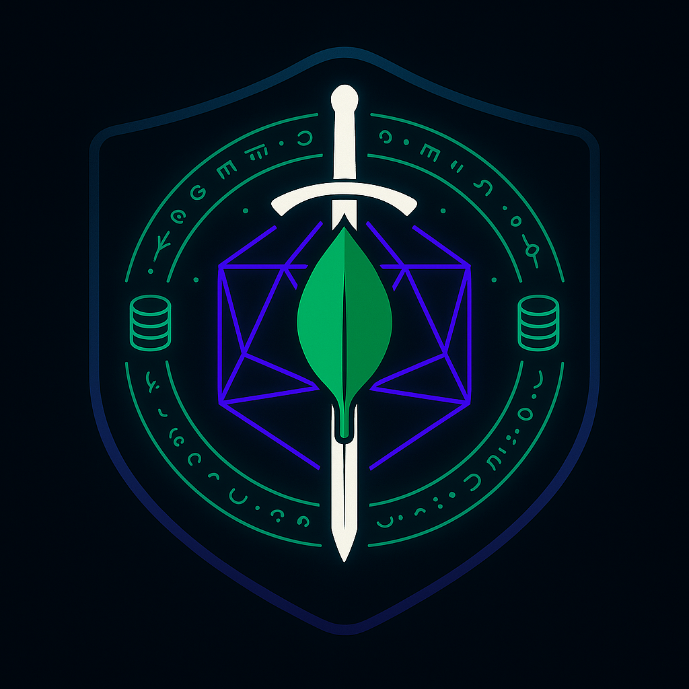
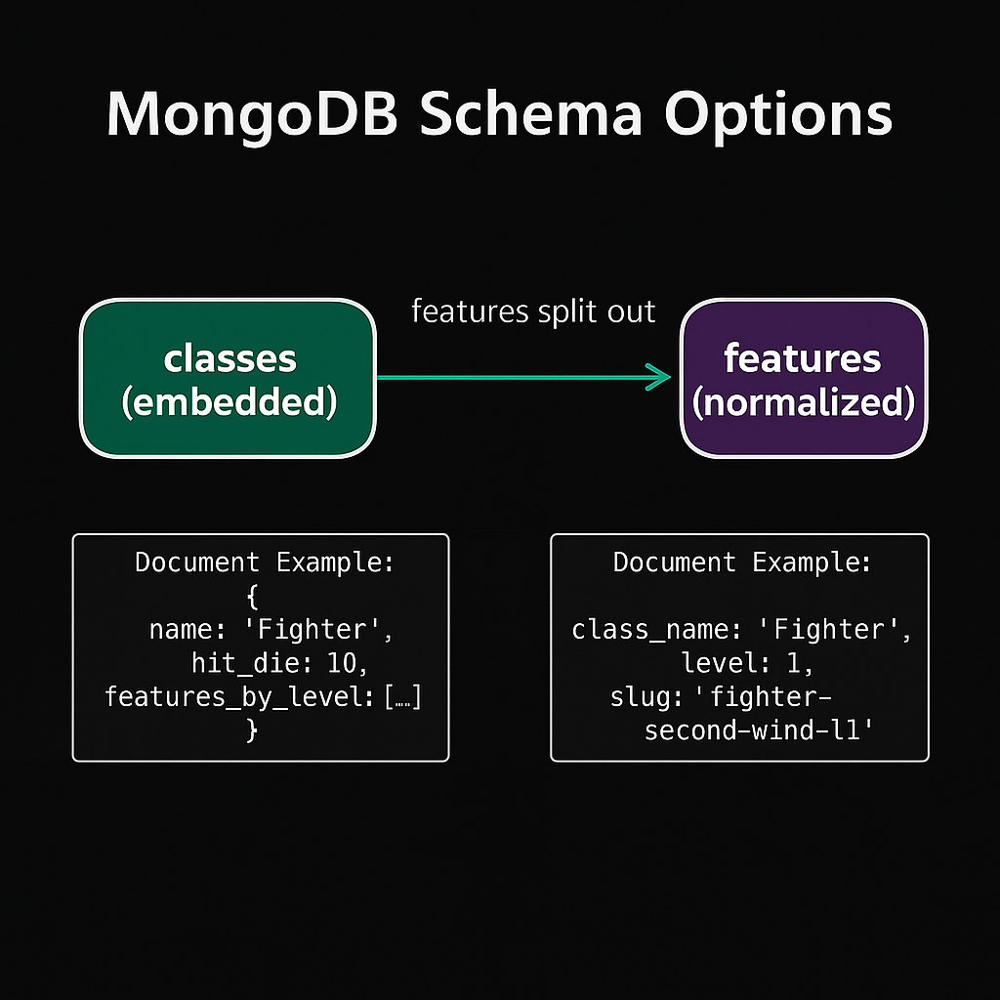
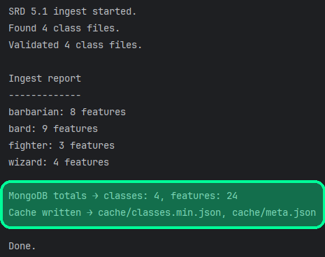

<p align="center">
  
</p>

<h1 align="center">D&D 5e SRD — MongoDB</h1>

<p align="center">
  <em>Automated SRD validation powered by MongoDB and GitHub Actions — structured data, legendary precision.</em>
</p>

[](https://github.com/dmtr-karan/dnd-srd-mongo/actions/workflows/ci.yml)  
[](https://github.com/dmtr-karan/dnd-srd-mongo/actions/workflows/validate.yml)
[](LICENSE)  
[](https://dnd.wizards.com/resources/systems-reference-document)  
[](https://www.python.org/downloads/)  
[](https://www.mongodb.com/)

<sub>Keywords: D&D, 5e, SRD, MongoDB, TTRPG</sub>


## ✨ What this is
A **production-style project** that ingests **D&D 5e SRD class data (levels 1–5)**, validates it with **JSON Schema**, and stores it in **MongoDB** in two forms:
- **Embedded `classes`** collection with full `features_by_level`
- **Normalized `features`** collection with stable slugs + indexes

It also emits **deterministic cache JSONs** for fast demos and ships a tiny **read helper layer** + tests.

This repository is part of a larger learning/demo project exploring how to build a **character progression engine** and other D&D tools on top of MongoDB.

---

## 📦 Features
- Canonical SRD class JSONs (`data/srd/classes/`)
- JSON Schema validation (`schemas/srd-class-5e-2014.json`)
- Ingest script (`scripts/ingest_srd.py`) with idempotent upserts
- Canonical indexes (`scripts/indexes.mongo.js`)
- Strict validator (`scripts/feature_validator.mongo.js`)
- Cache emitter (`cache/classes.min.json`, `cache/meta.json`)
- Smoke + helper tests (`tests/`)

---

## 📁 Repo Structure

```
dnd-srd-mongo/
├─ .github/
│  └─ workflows/
│     ├─ ci.yml                         # Manual/legacy CI (reference)
│     ├─ issues.yml                     # Logs new issues to run summary
│     └─ validate.yml                   # Main validation + artifacts pipeline
├─ assets/
│  ├─ crest.png                         # README header (square)
│  ├─ crest_social.png                  # 1280×640 social preview
│  ├─ crest_widescreen.png              # 16:9 variant
│  ├─ ingest.png                        # Validation/ingest screenshot (square)
│  ├─ ingest_wide.png                   # 16:9 variant
│  ├─ schema.png                        # Schema diagram (square)
│  └─ schema_wide.png                   # 16:9 variant
├─ cache/                               # Deterministic cache JSONs for demos
│  ├─ classes.min.json
│  └─ meta.json
├─ data/
│  └─ srd/
│     ├─ classes/                       # Canonical SRD class JSONs
│     │  ├─ barbarian.json
│     │  ├─ bard.json
│     │  ├─ fighter.json
│     │  └─ wizard.json
│     └─ raw/                           # Source SRD (pre-normalization)
│        ├─ barbarian.json
│        ├─ bard.json
│        ├─ fighter.json
│        └─ wizard.json
├─ schemas/
│  └─ srd-class-5e-2014.json            # JSON Schema (validation)
├─ scripts/
│  ├─ feature_validator.mongo.js        # Strict collection validator
│  ├─ indexes.mongo.js                  # Canonical indexes
│  ├─ ingest_srd.py                     # Idempotent ETL/ingest
│  ├─ read_helpers.py                   # Tiny read layer (example queries)
│  └─ __init__.py
├─ tests/
│  ├─ test_read_helpers.py
│  ├─ test_smoke.py
│  └─ test_validator.py
├─ .env.example                         # Example env vars (local)
├─ .gitignore
├─ CHANGELOG.md
├─ CONTRIBUTING.md
├─ LICENSE.txt
├─ README.md
├─ environment.yml                      # Conda environment (optional)
├─ pytest.ini                           # Pytest config
└─ requirements.txt                     # Pinned dependencies
```

---

## 🗂️ Schema Design — Embedded vs Normalized

This project demonstrates two complementary MongoDB schema approaches for the same SRD class data:

- **Embedded** → all class features by level are stored inside each class document.  
- **Normalized** → features are stored in a separate collection with slugs and indexes, deduplicating shared rules.  

<p align="center">
  
</p>

> **Why both?**  
> Embedded schemas make common reads self-contained; normalized avoids duplication and enables cross-class analytics.

---

## 🚀 Quickstart

### 1. Environment (Conda recommended)
~~~bash
conda env create -f environment.yml
conda activate srd-mongo
~~~

### 1b. Environment variables
This repo reads the Mongo connection string from the **environment variable** `MONGODB_URI`.
`.env.example` is a convenient template for local development (CI sets `MONGODB_URI` explicitly in workflows).

1) Copy the template:
**Linux/macOS/Git Bash**
~~~bash
cp .env.example .env
~~~

**Windows PowerShell**
~~~powershell
copy .env.example .env
~~~

2) Load `.env` into your current shell session (so `MONGODB_URI` is actually set):

**Linux/macOS/Git Bash**
~~~bash
set -a
source .env
set +a
~~~

**Windows PowerShell**
~~~powershell
Get-Content .env | ForEach-Object {
  if ($_ -match '^\s*#' -or $_ -match '^\s*$') { return }
  $k, $v = $_.Split('=', 2)
  Set-Item -Path "env:$k" -Value $v
}
~~~

### 2. Start MongoDB (Windows examples)
Service install:
~~~powershell
net start MongoDB
~~~

Portable run:
~~~powershell
mongod --dbpath "C:\path\to\your\data"
~~~

### 3. Apply indexes + validator
~~~powershell
mongosh "mongodb://localhost:27017/dnd_srd" scripts/indexes.mongo.js
mongosh "mongodb://localhost:27017/dnd_srd" scripts/feature_validator.mongo.js
~~~

### 4. Ingest SRD data
~~~powershell
python scripts/ingest_srd.py
~~~

### 5. Run tests
~~~powershell
pytest -q
~~~

---

### 🔎 Example Queries

Using the helper layer in Python:

~~~python
from scripts.read_helpers import list_classes, features_by_class_level, feature_by_slug

print(list_classes())                               # SRD classes
print(features_by_class_level("Fighter", 1))        # Fighter level-1 features
print(feature_by_slug("fighter-second-wind-l1"))    # Lookup by slug
~~~

Outputs (click to expand):

<details><summary>A) <code>list_classes()</code></summary>

~~~text
[{'srd_id': 'class:barbarian:srd-5-1', 'hit_die': 12, 'name': 'Barbarian'}, {'srd_id': 'class:bard:srd-5-1', 'hit_die': 8, 'name': 'Bard'}, {'srd_id': 'class:fighter:srd-5-1', 'hit_die': 10, 'name': 'Fighter'}, {'srd_id': 'class:wizard:srd-5-1', 'hit_die': 6, 'name': 'Wizard'}]
~~~

</details>

<details><summary>B) <code>features_by_class_level("Fighter", 1)</code></summary>

~~~text
[{'slug': 'fighter-fighting-style-l1', 'name': 'Fighting Style'}, {'slug': 'fighter-second-wind-l1', 'name': 'Second Wind'}]
~~~

</details>

<details><summary>C) <code>feature_by_slug("fighter-second-wind-l1")</code></summary>

~~~text
{'level': 1, 'class_srd_id': 'class:fighter:srd-5-1', 'slug': 'fighter-second-wind-l1', 'class_name': 'Fighter', 'description_md': 'You have a limited well of stamina that you can draw on to protect yourself.', 'edition': '5e-2014', 'license': 'CC-BY-4.0', 'meta': {'imported_at': '2025-10-02T09:51:08Z', 'import_version': 1}, 'name': 'Second Wind', 'source': 'SRD 5.1', 'srd_feature_id': 'fighter:second-wind'}
~~~

</details>

---

## ⚙️ CI/CD Highlights

Automated pipelines run on **GitHub Actions**, validating SRD JSON files, spinning up a temporary MongoDB service, and publishing a compact run summary.

| Workflow | Purpose | Key Features |
|---|---|---|
| **validate.yml** | Core validation pipeline | Triggers on push and manual runs · sets up Python + Mongo service · executes schema validation & ingest · uploads summary and artifacts via `$GITHUB_STEP_SUMMARY`. |
| **ci.yml** | Manual reference workflow | Retained for custom validation jobs and controlled test runs. |
| **issues.yml** | Issue event logger | Runs when a new GitHub Issue is opened · echoes title, author, labels · writes a short summary to the run. |

> All workflows are idempotent and use pip caching via `actions/setup-python@v5`. Each can also be triggered manually with `workflow_dispatch`.

<p align="center">
  
</p>

---

## 🧭 Status & Roadmap

**Current status (`v0.3.0`):**
- Local SRD sample data (classes + features) included.
- Example read queries in README; CI is green on `main`.

**Next steps:**
- **Ingest CLI** (`scripts/ingest_srd.py`): read local SRD JSON, validate with JSON Schema, write both:
  - **Embedded** (`classes_embedded`) for simple reads.
  - **Normalized** (`features`, `classes_refs`) for dedup & analytics.
- **DX:** `.env.example`, `Makefile` targets (`make ingest`, `make drop:test`, `make validate`).
- **CI:** schema validation job to fail on invalid data.
- **Licensing:** keep SRD content under CC-BY-4.0 with explicit attribution.

**Planned Extensions:**
- Read-only API (FastAPI) or small Streamlit viewer.
- Atlas how-to with secure connection notes.

---

## 📜 License
- MIT (code)
- SRD 5.1 content under Creative Commons **CC-BY-4.0**

## SRD Data & Attribution
Portions of this repository (`data/srd/classes/`) are based on the *Dungeons & Dragons® 5.1 System Reference Document (SRD)* by Wizards of the Coast, used under Creative Commons Attribution 4.0 International (CC-BY-4.0).

Source: [https://dnd.wizards.com/resources/systems-reference-document](https://dnd.wizards.com/resources/systems-reference-document)  
Attribution: *“Dungeons & Dragons® 5.1 System Reference Document (SRD) — Wizards of the Coast. Used under CC-BY-4.0.”*

All SRD content remains © Wizards of the Coast.
